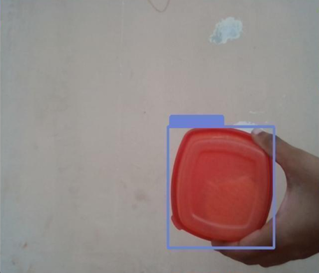
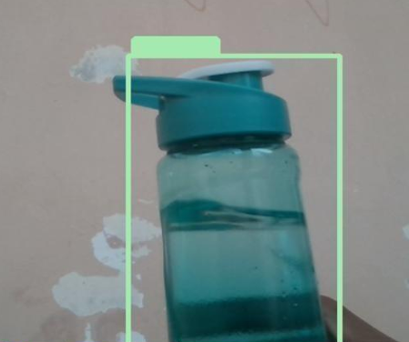
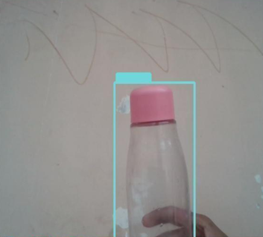

# Plastic Waste Detection Using Machine Learning

## 📌 Overview
This project presents an AI-powered plastic waste detection system that identifies plastic objects in real time using computer vision and deep learning. The objective is to automate plastic waste detection to support efficient recycling and environmental monitoring.

## 🚀 Features
- Real-time plastic waste detection
- YOLO-based object detection
- Image preprocessing and feature extraction
- Bounding box visualization
- Real-time detection alerts
- Supports multiple plastic object categories

## 🛠️ Technologies Used
- Python
- OpenCV
- YOLO
- NumPy
- TensorFlow / PyTorch
- VS Code

## 🔄 Methodology
1. Dataset Collection
2. Image Preprocessing
3. Feature Extraction
4. Model Training
5. Object Detection
6. Real-time Prediction
7. Performance Evaluation

## 📊 Results
- Detection Accuracy: **92%**
- Successfully detects:
  - Plastic Bottles
  - Plastic Containers
  - Plastic Toothbrushes
  - Other Plastic Objects

## 🔮 Future Improvements
- Raspberry Pi deployment
- Drone-based monitoring
- IoT integration
- Cloud dashboard
- Edge AI optimization

## 📄 Project Report
The complete project report is available in this repository:

**Project_Report.pdf**

## 👨‍💻 Author
**Tamiri Hemakar**
- B.Tech, Electronics and Communication Engineering
- National Institute of Technology Nagaland

## 📸 Sample Results

### Plastic Box Detection

### Plastic Bottle Detection

### Plastic Bottle Detection (Sample 2)

